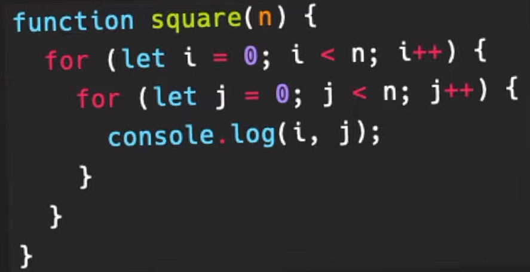

# The purpose of this document is to review big o notation as it has been a while since I've touched them.

---

## Constant Time
- When the output doesn't scale with the input. Increasing input has no impact on output time or space wise
- Constant time is considered negligible as it is too small to matter. As n increases to infinity, constants are too negligible.
```
function func(arr) {
	console.log(100*1000) 
}
```
- Notice in the example as arr increases, output does NOT increase
- ***Denoted*** Big O(1)

## Linear Time
- When output increases proportionately to increases in input.
- ***Denoted*** Big O(n)

## n^2
- Nested for loops that has two loops
- Creates a matrix where you can multiply length by height to get the area....which unsurprisingly leads to n^2
```
function square(n) {
	for (let i = 0; i < 4; i++) {
		for (let j = 0; j < 0; j++) {
			console.log(i, j);
		}
	}
}
```

- ***Denoted*** Big O(n^2)